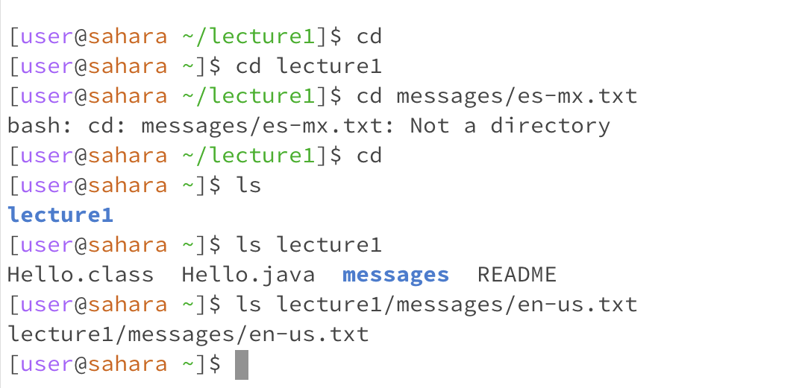
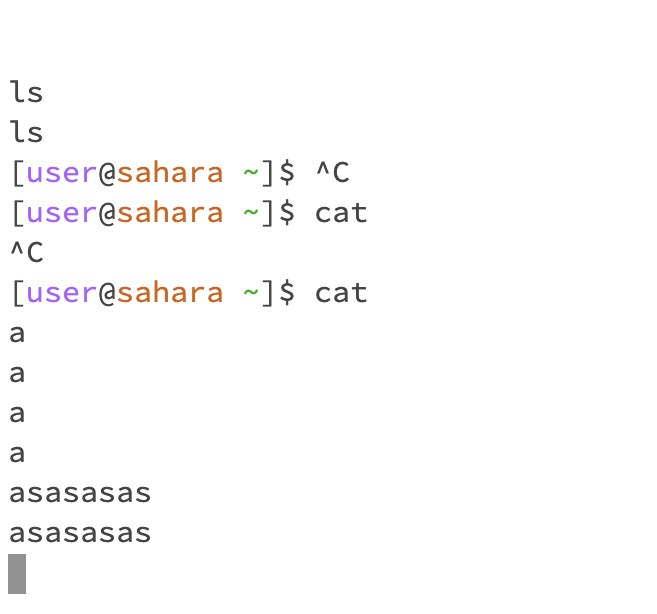
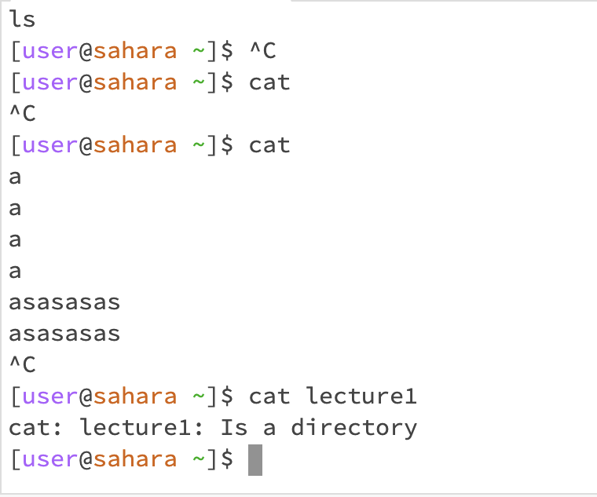

# Lab 1 Report

**Here is the "cd" command without any arguments, it goes one directory above if possible except if it's root.**

**Here is the "cd" command with a directory as an argument, it will go into that directory.**

**Here is the "cd" command with a file path as an argument, it will tell you it is not a directory and do nothing.**

**Here is the "ls" command with no arguments, it will display the directories and files below.**

**Here is the "ls" command with a directory as an argument, it will display the files and directories inside.**

**Here is the "ls" command with a file path as an argument, it will just repeat the argument and do nothing.**

**Here is the "cat" command with no arguments, it will just repeat what you type in unless you click Ctrl^C.**

**Here is the "cat" command with a directory as an argument, it will just tell you that it is a directory.**

