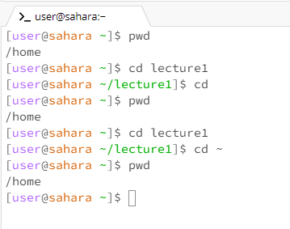
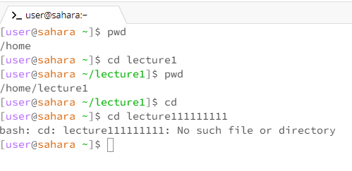
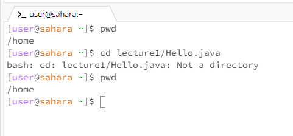
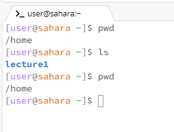
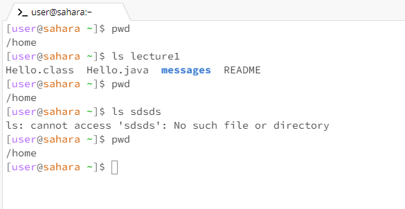
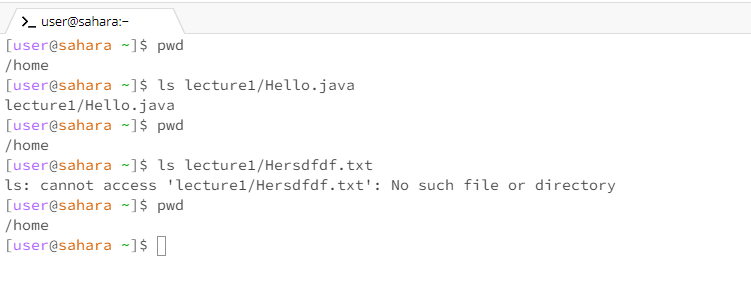
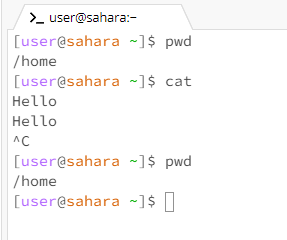
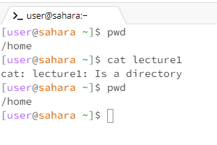
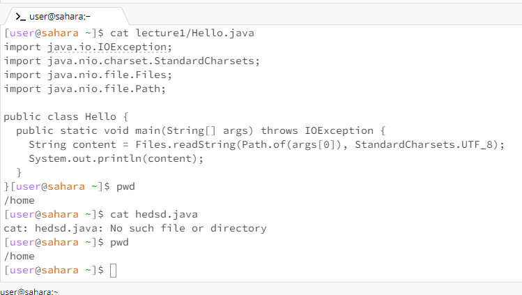

# Lab 1 Report

**Here is the "cd" command without any arguments, it takes you to the home directory which is also known as "~". This would be equivalent to doing "cd ~".**

**Here is the "cd" command with a directory as an argument, it will go into that directory if it exists. If not it will throw an error message saying it doesn't exist.**

**Here is the "cd" command with a file path as an argument, it will throw an error message saying that it is not a directory.**

**Here is the "ls" command with no arguments, it will display the directories and files from the current directory.**

**Here is the "ls" command with a directory as an argument, it will display the files and directories inside the specified directory. If it can't find the directory it will throw an error message.**

**Here is the "ls" command with a file path as an argument, it will just repeat the argument and do nothing. If it can't find the file path it will throw an error saying no such file or directory**

**Here is the "cat" command with no arguments, it will just repeat what you type in unless you enter Ctrl^C or Ctrl^D.**

**Here is the "cat" command with a directory as an argument, it will just tell you that it is a directory. It is not an error message.**

**Here is the "cat" command with a file as an argument, it will print the contents of that file if it is a valid path. If it can't find the file or directory it will throw an error message.**

