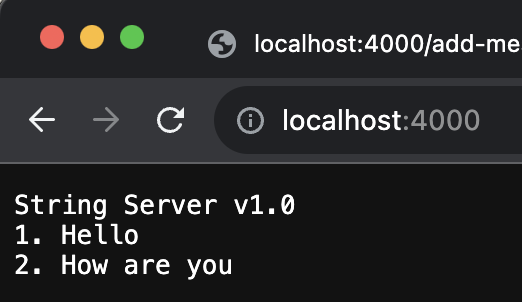

# Lab 2 Report

 

The way StringServer works is that everytime we navigate to the website it sends a request to the server, and when that request is sent to the server we call the handleRequest method in our Handler class. We are looping the handleRequest method in Server.start() to see if any request is being made to the site. The way we access that request is through the URI object which is the argument in the handleRequest method. At the beginning of our method we are accessing the path from URI object to determine how to handle that request. If the path is just a "/" we print the contents of Strings stored inside the ArrayList using StringBuilder and a for loop since returning a String is how we print to the website. And else if the path is "/add-message?s=Example String" we store everything after the "=" as a String inside our ArrayList. The way we do this is we first check if the path has "/add-message" in their using the .getPath() method for URI objects. When we use this method we ignore everything including the question mark. It is important to note that the question mark is the seperator in the URL when we use the .getPath() method. Next we call the .getQuery() method for URI objects and split using the .split() method for Strings and store it as a String array. Next we check if the first array is an "s" since that is before the equals. Finally since we have verified that the path is correct we add the String to the ArrayList. And as a confirmation we print the String and say it was added. Everytime we visit that website a new URI object is constructed with the URL we entered to get there. This way we can keep track of the paths being entered in the URL.

  

Here you can see ther StringServer in action, I first added "wow" using "/add-message?s="wow" and then I did the same for "Hello World". After that I just went to the home page and you can see it prints the contents of the Strings.

Path to the private key stored on my MacBook.

Path to the public key stored on the ieng6 sever.

Here is me logging in without a password to the ieng server.

### What did I learn from lab 2 or 3?

