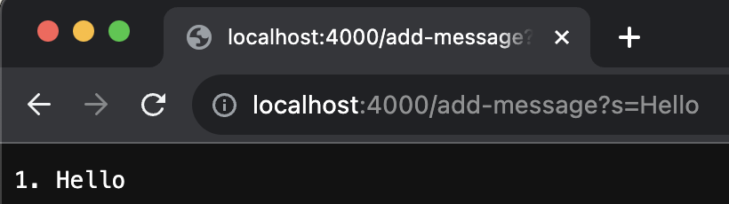
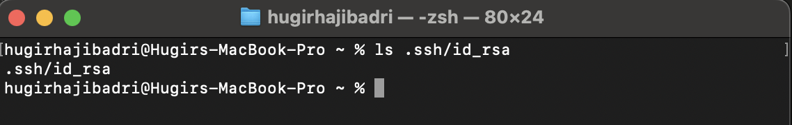

# Lab 2 Report

 

The way StringServer works is that everytime we navigate to the website it sends a request to the server, and when that request is sent to the server we call the handleRequest method in our Handler class. We are looping the handleRequest method in Server.start() to see if any request is being made to the site. The way we access that request is through the URI object which is the argument in the handleRequest method. At the beginning of our method we are accessing the path from URI object to determine how to handle that request. If the path is just a "/" we print the contents of Strings stored inside the ArrayList using StringBuilder and a for loop since returning a String is how we print to the website.

When the path is "/add-message?s=Example String" we first call the handleRequest(URI url) method of the Handler class. We use url.getPath() from the method argument to confirm the path entered and then we use url.getQuery().split("=") to extract the Strings after the "=" into String[] parameters. We then call the parameters[0].equals("s") because we want to confirm the url is correctly by having the "s" in there. After that we use the strs.add(parameters[1]) method to add the String to the ArrayList which is the field of the class. The only field of the class that gets updated is the ArrayList. We update StringBuilder too but it is a temporary object only for concetanting and formatting for the ArrayList. String[] parameters is also a temporary object to store what we extract from the url using the URI object. We access the url object from the argument of the handleRequest(URI url) class but we don't change anything to it because we only need to read from it to figure out the url entered in the request.

  

Here you can see ther StringServer in action, I first added "Hello" using "/add-message?s="wow" and then I did the same for "How are you". After that I just went to the home page and you can see it prints the contents of the Strings.

Path to the private key stored on my MacBook.

Path to the public key stored on the ieng6 sever.

Here is me logging in without a password to the ieng server.

### What did I learn from lab 2 or 3?

I learned how java servers work and how they handle requests. I also learned that you can use SSH to login without a password by generating a private and public key which is the most convenient feature. Before these two weeks I didn't know how how URL's work, more specifically I knew that there is a domain and path but I didn't know how the paths were handled. In addtion I learned how to copy files from my MacBook to the server using scp (Secure Copy Protocol).

