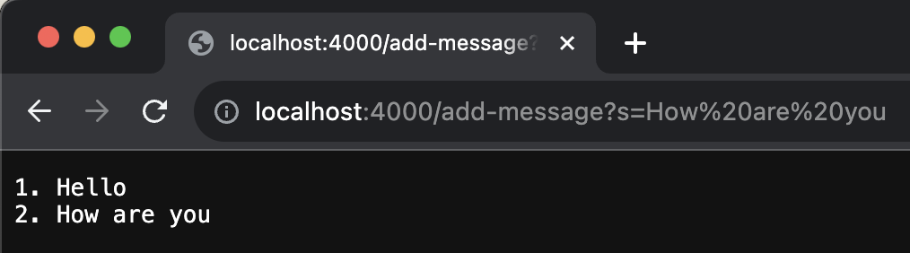

# Lab 2 Report

 

  

> Here you can see ther StringServer in action, I first added "wow" using "/add-message?s="wow" and then I did the same for "Hello World". After that I just went to the home page and you can see it adds the strings.
