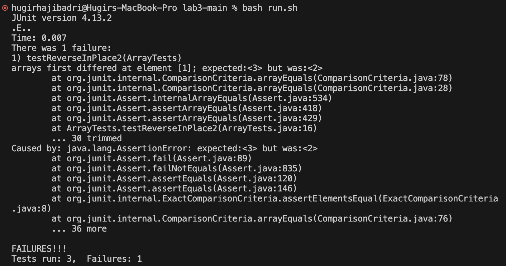

# Lab 3 Report

**I choose ArrayExamples and ArrayTests to demonstrate the bug and symptom.**

```java
@Test
public void testReverseInPlace2()
{
    int[] input1 = { 3, 2 };
    ArrayExamples.reverseInPlace(input1);
    assertArrayEquals(new int[]{ 2, 3 }, input1);
}
```

This is the failure-inducing input.

```java
@Test
public void testReverseInPlace()
{
    int[] input1 = { 3 };
    ArrayExamples.reverseInPlace(input1);
    assertArrayEquals(new int[]{ 3 }, input1);
}
```

This input doesn't result in failure because a 1 element array does not need to be reversed.



Here is the output of JUnit showing the symptom. The second test failed because it did not correctly reverse the array.

```java
static void reverseInPlace(int[] arr)
{
    for(int i = 0; i < arr.length; i++)
    {
        arr[i] = arr[arr.length - 1 - i];
    }
}
```

Before fixing the bug.

```java
static void reverseInPlace(int[] arr)
{
    for(int i = 0; i < arr.length / 2; i++)
    {
        int temp = arr[i];
        arr[i] = arr[arr.length - 1 - i];
        arr[arr.length - 1 - i] = temp;
    }
}
```

After fixing the bug. The bug was we were not swapping arr[arr.length - 1 - i] with arr[i]. This is becuase when we assign arr[i] to arr[arr.length - 1 - i] we  lose the value of what arr[i] originally was. To fix this we introduce a temp variable to hold the value of arr[i] so that when we assign arr[i] to arr[arr.length - 1 - i] we can simply assign arr[arr.length - 1 - i] to temp. We also only need to traverse half the array because we are swapping the beginning elements from the ones at the end.

**grep -i**

```shell
hugirhajibadri@Hugirs-MacBook-Pro docsearch % grep -i "convergent evolution" ./technical/*/*
./technical/biomed/1471-2148-3-18.txt:        centers through convergent evolution. Two of these classes
./technical/biomed/1471-2148-3-18.txt:        developed through convergent evolution [ 30 ] seems flawed:
./technical/biomed/1471-2148-3-18.txt:        convergent evolution at a sequence level [ 33 34 ] we
./technical/biomed/1471-2164-3-4.txt:          pressures that led to convergent evolution in two
./technical/biomed/gb-2002-3-5-research0025.txt:          structure might have arisen by convergent evolution from
./technical/biomed/gb-2002-3-5-research0025.txt:          fold and have evolved by convergent evolution in
./technical/biomed/gb-2003-4-2-r14.txt:          lineages or from convergent evolution. Parametric
grep: ./technical/government/About_LSC: Is a directory
grep: ./technical/government/Alcohol_Problems: Is a directory
grep: ./technical/government/Env_Prot_Agen: Is a directory
grep: ./technical/government/Gen_Account_Office: Is a directory
grep: ./technical/government/Media: Is a directory
grep: ./technical/government/Post_Rate_Comm: Is a directory
./technical/plos/journal.pbio.0030021.txt:        the convergent evolution of sex determination related to mating system adaptations. An
hugirhajibadri@Hugirs-MacBook-Pro docsearch % 
```

```shell
hugirhajibadri@Hugirs-MacBook-Pro docsearch % grep -i "octopus" ./technical/*/*             
grep: ./technical/government/About_LSC: Is a directory
grep: ./technical/government/Alcohol_Problems: Is a directory
grep: ./technical/government/Env_Prot_Agen: Is a directory
grep: ./technical/government/Gen_Account_Office: Is a directory
grep: ./technical/government/Media: Is a directory
grep: ./technical/government/Post_Rate_Comm: Is a directory
./technical/plos/journal.pbio.0020430.txt:        “Dr. Octopus,” the villain that terrorizes the city in the most recent film of the
./technical/plos/journal.pbio.0020430.txt:        with the BMI, becomes the villainous Dr. Octopus. At the end of the movie, in a flicker of
./technical/plos/journal.pbio.0020430.txt:        Although Dr. Octopus is a fictional character, a figment of a vivid imagination,
./technical/plos/journal.pbio.0020430.txt:        Octopus. The fictional BMI in 
hugirhajibadri@Hugirs-MacBook-Pro docsearch % 
```
Using "-i" means grep will do a case insensitive search rather than the default cause sensitive search. This is useful if you are trying to find all occurences of a string no matter the capitalization. Also words at the beginning of a sentence will have the first letter capitalized so this would help when using "grep -i". Found with "man grep".

**grep -l**

```shell
hugirhajibadri@Hugirs-MacBook-Pro docsearch % grep -l "birds" ./technical/*/*
./technical/biomed/1471-2105-3-2.txt
./technical/biomed/1471-2148-1-4.txt
./technical/biomed/1471-2148-2-17.txt
./technical/biomed/1471-2180-3-10.txt
./technical/biomed/1472-6785-1-3.txt
./technical/biomed/gb-2000-1-1-research002.txt
./technical/biomed/gb-2002-3-5-research0025.txt
./technical/biomed/gb-2003-4-3-r18.txt
grep: ./technical/government/About_LSC: Is a directory
grep: ./technical/government/Alcohol_Problems: Is a directory
grep: ./technical/government/Env_Prot_Agen: Is a directory
grep: ./technical/government/Gen_Account_Office: Is a directory
grep: ./technical/government/Media: Is a directory
grep: ./technical/government/Post_Rate_Comm: Is a directory
./technical/plos/journal.pbio.0020350.txt
./technical/plos/journal.pbio.0020354.txt
./technical/plos/journal.pbio.0020406.txt
./technical/plos/journal.pbio.0020440.txt
./technical/plos/journal.pbio.0030056.txt
./technical/plos/journal.pbio.0030127.txt
./technical/plos/journal.pbio.0030137.txt
hugirhajibadri@Hugirs-MacBook-Pro docsearch % 
```

```shell
hugirhajibadri@Hugirs-MacBook-Pro docsearch % grep -i -l "darwin" ./technical/*/*
./technical/biomed/1471-2105-3-2.txt
./technical/biomed/gb-2001-2-9-research0035.txt
./technical/biomed/gb-2003-4-9-r58.txt
grep: ./technical/government/About_LSC: Is a directory
grep: ./technical/government/Alcohol_Problems: Is a directory
grep: ./technical/government/Env_Prot_Agen: Is a directory
grep: ./technical/government/Gen_Account_Office: Is a directory
grep: ./technical/government/Media: Is a directory
grep: ./technical/government/Post_Rate_Comm: Is a directory
./technical/plos/journal.pbio.0020046.txt
./technical/plos/journal.pbio.0020071.txt
./technical/plos/journal.pbio.0020302.txt
./technical/plos/journal.pbio.0020311.txt
./technical/plos/journal.pbio.0020346.txt
./technical/plos/journal.pbio.0020347.txt
./technical/plos/journal.pbio.0020439.txt
hugirhajibadri@Hugirs-MacBook-Pro docsearch % 
```

Using the "-l" option for grep means that any matches found will only result in printing the name and path of the file instead of the actual line where it finds the pattern. This could be useful if you are trying to find which files have a specific phrase, a practical example is if you are trying to search for code that you know contains a bug and you want a list of all the files that contain it so you can fix it. Found with "man grep".

**grep -r**

```shell
hugirhajibadri@Hugirs-MacBook-Pro docsearch % grep -i -r "octopus" ./technical
./technical/plos/journal.pbio.0020430.txt:        “Dr. Octopus,” the villain that terrorizes the city in the most recent film of the
./technical/plos/journal.pbio.0020430.txt:        with the BMI, becomes the villainous Dr. Octopus. At the end of the movie, in a flicker of
./technical/plos/journal.pbio.0020430.txt:        Although Dr. Octopus is a fictional character, a figment of a vivid imagination,
./technical/plos/journal.pbio.0020430.txt:        Octopus. The fictional BMI in 
hugirhajibadri@Hugirs-MacBook-Pro docsearch % 
```

```shell
hugirhajibadri@Hugirs-MacBook-Pro docsearch % grep -i -r "Darwin" technical
technical/plos/journal.pbio.0020347.txt:        described by Charles Darwin (1859).
technical/plos/journal.pbio.0020347.txt:        Not all genetic variation is created equal. When Darwin first introduced the concept of
technical/plos/journal.pbio.0020347.txt:        evolution (Darwin 1859), he challenged the prevailing view that species were fixed entities
technical/plos/journal.pbio.0020346.txt:        on the traditional comparative approach, which was always the strength of Darwinian
technical/plos/journal.pbio.0020046.txt:        answers to possible questions and criticisms to avoid stuttering. Charles Darwin also
technical/plos/journal.pbio.0020046.txt:        stuttered; interestingly, his grandfather Erasmus Darwin suffered from the same condition,
technical/plos/journal.pbio.0020302.txt:        turn to be consumed by predators. Darwinian evolution would result in many of the same
technical/plos/journal.pbio.0020311.txt:        out by Charles Darwin and his son Francis in 1880. The Darwins were able to demonstrate
technical/plos/journal.pbio.0020071.txt:        are many ideologically motivated books opposing natural selection and Darwinism. To
technical/plos/journal.pbio.0020439.txt:        location within the head (Hsieh 2003). Charles Darwin was right when he wrote that people
technical/plos/journal.pbio.0020439.txt:        extra sense” (F. Darwin 1905). Today's biologists increasingly recognize that appropriate
technical/biomed/gb-2003-4-9-r58.txt:        locations. The DARWIN server [ 30 ] was used to calculate
technical/biomed/gb-2001-2-9-research0035.txt:        manually evaluating the results from BLAST and DARWIN (data
technical/biomed/gb-2001-2-9-research0035.txt:          and DARWIN. BLAST analyses were carried out for both the
technical/biomed/gb-2001-2-9-research0035.txt:        GenProtEC, BLAST and DARWIN analyses, and MAGPIE
technical/biomed/gb-2001-2-9-research0035.txt:            DARWIN analysis
technical/biomed/gb-2001-2-9-research0035.txt:            DARWIN (version 2.0) was used to detect
technical/biomed/gb-2001-2-9-research0035.txt:            the basis of the DARWIN results. In our hands, DARWIN
technical/biomed/gb-2001-2-9-research0035.txt:            BLAST and DARWIN analyses. The automatic function
technical/biomed/1471-2105-3-2.txt:        In the 1830's, Charles Darwin's investigation of the
technical/biomed/1471-2105-3-2.txt:        In the 1970's, Woese and Fox revisited Darwinian
hugirhajibadri@Hugirs-MacBook-Pro docsearch % 
```

The "-r" feature in grep is very useful because it will recursively search all files in the directory and subdirectories. Without this feature you will have to use somethign like "./technical/*/*" but even then this will not search all files because you are specifying the directories grep can access. Basically -r will search all files. Found with ChatGPT.


