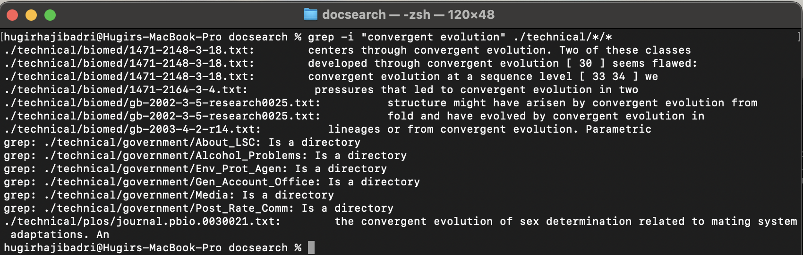
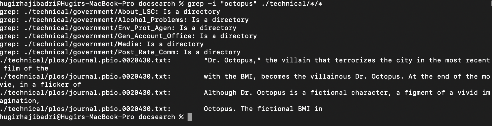

# Lab 3 Report

**I choose ArrayExamples and ArrayTests to demonstrate the bug and symptom.**

```java
@Test
public void testReverseInPlace2()
{
    int[] input1 = { 3, 2 };
    ArrayExamples.reverseInPlace(input1);
    assertArrayEquals(new int[]{ 2, 3 }, input1);
}
```

This is the failure-inducing input.

```java
@Test
public void testReverseInPlace()
{
    int[] input1 = { 3 };
    ArrayExamples.reverseInPlace(input1);
    assertArrayEquals(new int[]{ 3 }, input1);
}
```

This input doesn't result in failure because a 1 element array does not need to be reversed.


Here is the output of JUnit showing the symptom. The second test failed because it did not correctly reverse the array.

```java
static void reverseInPlace(int[] arr)
{
    for(int i = 0; i < arr.length; i++)
    {
        arr[i] = arr[arr.length - 1 - i];
    }
}
```

Before fixing the bug.

```java
static void reverseInPlace(int[] arr)
{
    for(int i = 0; i < arr.length / 2; i++)
    {
        int temp = arr[i];
        arr[i] = arr[arr.length - 1 - i];
        arr[arr.length - 1 - i] = temp;
    }
}
```

After fixing the bug. The bug was we were not swapping arr[arr.length - 1 - i] with arr[i]. This is becuase when we assign arr[i] to arr[arr.length - 1 - i] we  lose the value of what arr[i] originally was. To fix this we introduce a temp variable to hold the value of arr[i] so that when we assign arr[i] to arr[arr.length - 1 - i] we can simply assign arr[arr.length - 1 - i] to temp. We also only need to traverse half the array because we are swapping the beginning elements from the ones at the end.

**I choose the grep command.**

`grep -i "convergent evolution" ./technical/*/*`





