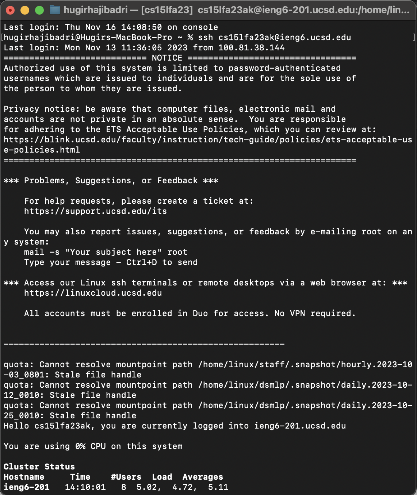
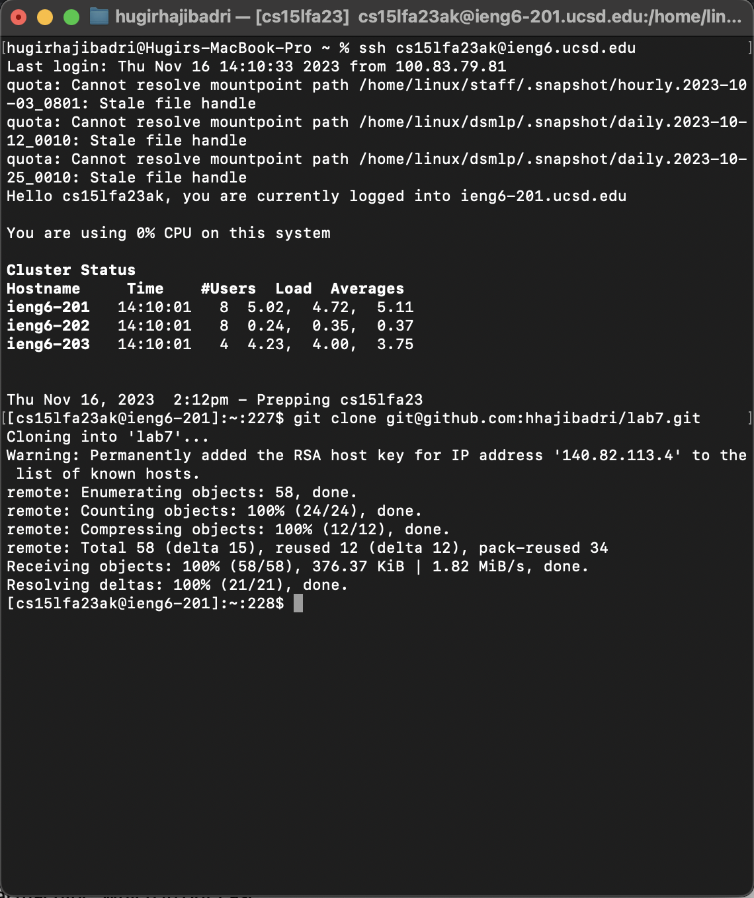
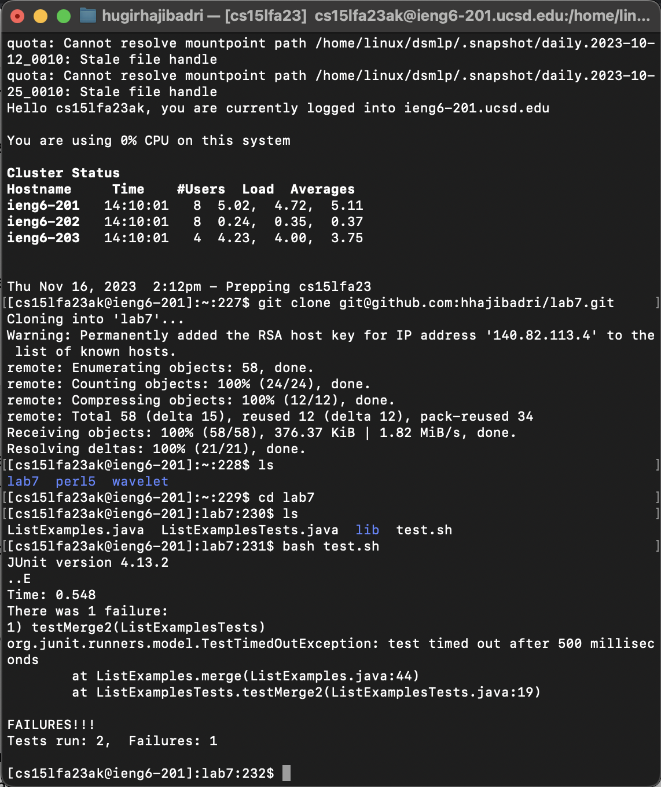
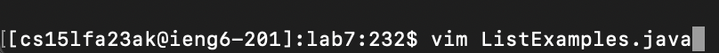
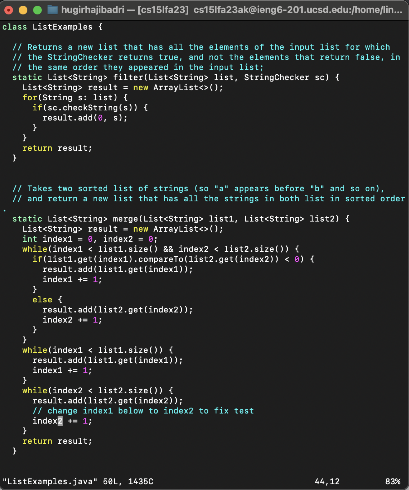
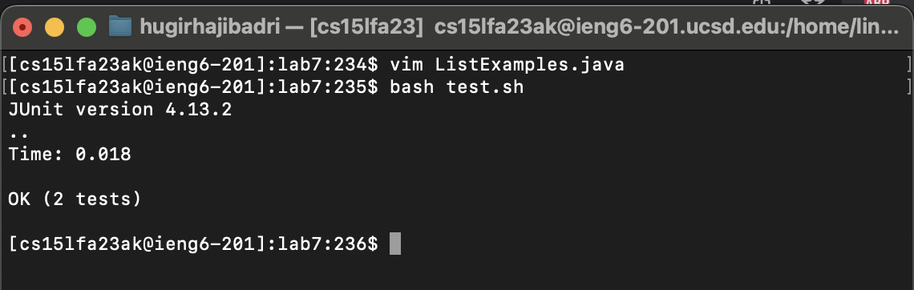
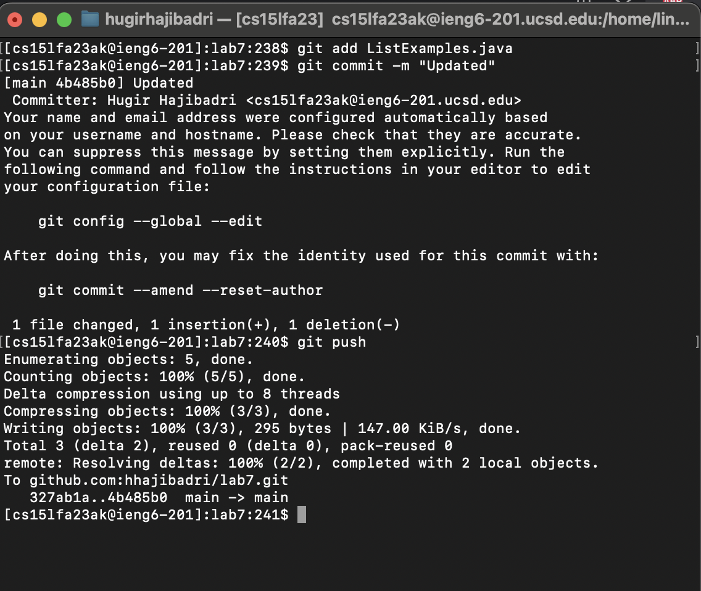

# Lab Report 4

I typed in `ssh cs15lfa23ak@ieng6.ucsd.edu<enter>` to login in to the ieng6 ucsd server using the ssh command.

I then typed `git clone git@github.com:hhajibadri/lab7.git<enter>` to clone my repository that I forked.

I typed in `ls<enter>` to find the path of the directory I cloned.
Then I typed in `cd lab7<enter>` to go into the directory.
After that I typed in `bash test.sh<enter>` to run the bash script thats tests the java files.

 

I then typed in `vim ListExamples.java<enter>` to go into vim to edit the file with the bug.
To get to the error using vim I pressed `43<down>e` to get the last character of `index1` on line 43.
I then pressed `r2` to replace the `1` to a `2` so it would become `index2`.
Finally I typed in `:wq<enter>` to save the file with my changes.

I then typed `bash test.sh<enter>` to rerun the test script with the updated java files and it passed the test.

First I staged `ListExamples.java` by typing in `git add ListExamples.java<enter>`.
I then committed these changes with a message by typing in `git commit -m "Updated"<enter>`.
Lastly I pushed these changes to my repository by typing in `git push<enter>` which updated those changes.

