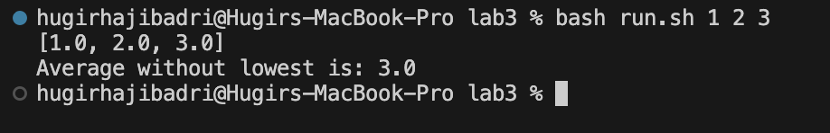

# Lab Report 5

Student: Hi everyone, I am having trouble locating and fixing a bug inside my program. My program has three methods, this only concerns one of them. This method is supposed to calculate the average of an array type of double without considering the minimum value. It is not calculating the average correctly so I am guessing the problem lies within the calculating the sum or dividing by the number of elements. I have attached the screenshot to my source code and input below.



TA: Try using the JDB to step through your program to figure out where the problem is. First compile with the special flag `java -g example.java` and then run JDB `jdb example.java`. You would want to set a breakpoint at the beginning of that method and step through each line to figure out how the values are being computed or updated.

Student: What I found with JDB is that I was not excluding the minimum value for the sum so it was adding all the elements instead of excluding the lowest value. So when my input was 1, 2, and 3 it was adding all of it (6) and dividing by it 2 to get 3.0. It should've done only 2 + 3 and divide it by 2 to get 2.5.


# File and Directory Strucuture

```
/lab3
|-- run.sh
|-- ArrayExamples.java
```

# Before Fix

```java
import java.util.Arrays;

public class ArrayExamples {

  public static void main(String[] args)
  {
    double[] nums = new double[args.length];

    for(int i = 0; i < args.length; i++)
    {
      nums[i] = Double.parseDouble(args[i]);
    }

    System.out.println(Arrays.toString(nums));
    System.out.println("Average without lowest is: " + averageWithoutLowest(nums));


  }

    // Averages the numbers in the array (takes the mean), but leaves out the
  // lowest number when calculating. Returns 0 if there are no elements or just
  // 1 element in the array
  static double averageWithoutLowest(double[] arr) {
    if(arr.length < 2) return 0.0;

    double lowest = arr[0];
    
    for(int i = 1; i < arr.length; i++)
    {
      if(lowest > arr[i]) lowest = arr[i];
    }

    double sum = 0;

    
    for(double num : arr)
    {
      sum += num;
    }

    return sum / (arr.length - 1);
  }
}
```

My run.sh script

```bash
set -e

javac ArrayExamples.java 
java ArrayExamples $@
```

# Command to Trigger Bug

```bash
bash run.sh 1 2 3
```

# Bug Description and Fix

The way I fixed the bug was simply to add an if statement in the for each loop to check if the current number in the array is not equal to the lowest and if it isn't equal then we add it to the sum otherwise we just continue.

```java
if(num != lowest) sum += num;
```


# Reflection

Something interesting I learned in the second half of the quarter was vim. Before learning about vim I always wondered if there was a way to do everything from the command line and it turned out there was. You can read, write, copy, and paste all from the command line. Although I am glad we have a graphical interface in todays day and age it was cool to see how manual things were back then in the beginning. Another thing I learned from the tutor is when compiling java treats the last expression as the class name. So for example if I typed in something like `java ~/Main` it doesn't handle paths it just treats `~/Main` as a name itself.